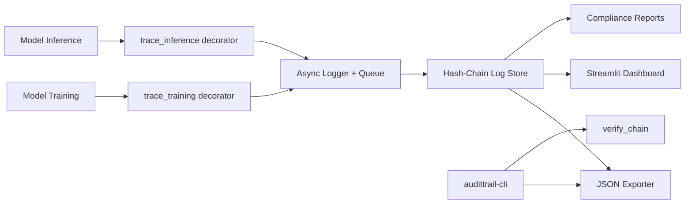

# AGENTS.md - AuditTrail Engineering Guide

This document orients engineers to the AuditTrail codebase, expected architecture, and engineering rules.

## 1. Purpose
AuditTrail is a Compliance-as-Code SDK for EU AI Act readiness. It traces training and inference, computes fairness metrics, and exports audit-ready reports. The SDK is designed to provide tamper-evident logs and high-throughput logging.

## 2. Repository Map (Current)
The system is organized around the SDK and the demo suite:

- `/.github/workflows/ci.yml` - CI pipeline running tests for Python 3.9 through 3.12.
- `/audittrail/sdk-python/` - Python SDK root (pyproject, README, tests).
- `/audittrail/sdk-python/audittrail/` - SDK package implementation:
  - `assets/` - static assets used by the SDK/demo.
  - `exporters/` - storage/export backends (JSON exporter).
  - `utils/` - shared helpers (hashing, integrity verification).
  - `cli.py` - CLI entry points (export report, verify chain).
  - `compliance.py` - fairness metrics and compliance checks.
  - `tracer.py` - core tracing decorators and logging flow.
  - `__init__.py` - init/config and public API surface.
- `/audittrail/sdk-python/tests/` - SDK test suite.
- `/audittrail/demo/` - demo and benchmarking scripts:
  - `benchmark.py`, `dashboard.py`, `fraud_detection_demo.py`, `generate_pitch_chart.py`, `pdf_exporter.py`, `server.py`.
- `/build_exe.ps1` - Windows build script.
- `/run-all.bat`, `/run-demo.bat` - helper scripts.

## 3. Architecture Diagram (High Level)

## 4. Key Modules (What They Do)

- `audittrail/__init__.py`
  - `init(project, risk_level, output_dir="./audit_logs")` initializes config and loads the previous hash from the log file if present.
  - `RiskLevel` enum values: `MINIMAL`, `LIMITED`, `HIGH`, `UNACCEPTABLE`.
  - `flush()` drains the async queue to disk.

- `audittrail/tracer.py`
  - `trace_training(dataset_version, fairness_metrics=None)` logs training start/end, duration, git commit, hyperparameters, and fairness checks.
  - `trace_inference(require_human_review_threshold=None)` logs inference start/end, shapes, max confidence, and `human_review_required`.
  - Async queue + worker; supports env config for mode, batch size, and flush interval.
  - Sinks: local (default), S3, Azure Blob (controlled by env vars).

- `audittrail/compliance.py`
  - `demographic_parity_difference(...)` uses a fixed threshold of 0.05 and returns `value`, `threshold`, and `violates`.
  - `calculate_fairness_metrics(metrics, y_true, y_pred, sensitive_attr)` currently supports `demographic_parity`.

- `audittrail/exporters/json_exporter.py`
  - `export_compliance_report(trace_ids=None, output_path=None)` groups by trace ID, aggregates compliance checks, counts violations, and writes JSON.

- `audittrail/utils/integrity.py`
  - `hash_entry(entry, previous_hash)` builds canonical hash payload.
  - `verify_chain(log_path)` validates hash integrity across the log file.

- `audittrail/cli.py`
  - `audittrail-cli export-report` generates a JSON compliance report.
  - `audittrail-cli verify-chain` verifies hash-chain integrity.

## 5. Public API Quick Reference
These are the supported SDK entry points and their signatures:

- `audittrail.init(project: str, risk_level: RiskLevel, output_dir: str = "./audit_logs") -> None`
- `audittrail.trace_training(dataset_version: str, fairness_metrics: list | None = None) -> Callable`
- `audittrail.trace_inference(require_human_review_threshold: float | None = None) -> Callable`
- `audittrail.flush() -> None`
- `audittrail.RiskLevel` enum: `MINIMAL`, `LIMITED`, `HIGH`, `UNACCEPTABLE`

CLI entry points:

- `audittrail-cli --project <name> --risk-level <level> [--output-dir <path>] export-report [--trace-ids <id...>] [--output-path <path>] [--output-dir <path>]`
- `audittrail-cli --project <name> --risk-level <level> [--output-dir <path>] verify-chain [--log-path <path>] [--output-dir <path>]`

## 6. Config Matrix (Environment Variables)
These env vars control logging mode and sinks:

| Variable | Default | Purpose | Notes |
| --- | --- | --- | --- |
| `AUDITTRAIL_MODE` | `async` | Logging mode | `sync` disables worker thread. |
| `AUDITTRAIL_BATCH_SIZE` | `100` | Batch size for async writes | Must be > 0 or default is used. |
| `AUDITTRAIL_FLUSH_INTERVAL` | `0.5` | Flush interval in seconds | Must be > 0 or default is used. |
| `AUDITTRAIL_SINK` | `local` | Log sink | `local`, `s3`, `azure`, `azure_blob`, `blob`. |
| `AUDITTRAIL_S3_BUCKET` | none | S3 bucket | Required when `AUDITTRAIL_SINK=s3`. |
| `AUDITTRAIL_S3_PREFIX` | `audittrail` | S3 key prefix | Used with project + timestamp. |
| `AUDITTRAIL_AZURE_CONNECTION_STRING` | none | Azure connection string | Required when `AUDITTRAIL_SINK=azure*`. |
| `AUDITTRAIL_AZURE_CONTAINER` | none | Azure container | Required when `AUDITTRAIL_SINK=azure*`. |
| `AUDITTRAIL_AZURE_PREFIX` | `audittrail` | Azure blob prefix | Used with project + timestamp. |

## 7. Core Capabilities (Product and Architecture)
AuditTrail currently provides:

- Two decorators to trace training and inference events.
- Tamper-evident logs using a hash-chain design.
- Async batching for high-throughput logging.
- Compliance report export (JSON) and demo PDF exporter.
- Fairness metric support (demographic parity currently).

## 8. Engineering Rules (Compliance-as-Code)
These rules apply to all new features and refactors:

- Hash-chain integrity: log entries must include the previous hash and be verifiable.
- Async logging performance: default logging must remain async and high-throughput.
- Fairness metrics: training traces must emit fairness metrics when configured.
- Human-in-the-loop: inference traces must be able to flag high-uncertainty cases.

## 9. Roadmap Modules (Not Yet in Repo)
These are future modules and should integrate with the existing SDK and reporting model:

- Risk-Classifier: wizard to classify AI systems by EU AI Act risk level, outputting structured guidance.
- Governance Portal: review interface for compliance officers to approve or reject human-in-the-loop flags.
- AI-Registry: registry of active models, linking versions, ownership, and compliance status.

## 10. Definition of Done
A change is complete only if:

- It conforms to the engineering rules in section 8.
- Tests pass in CI (Python 3.9-3.12).
- Any new log fields are reflected in reporting and demos (if applicable).

## 11. Local Development Quick Start
For SDK work:

- Install from the SDK folder with demo/test extras: `pip install -e ".[test,demo]"`.
- Run tests: `pytest -v`.
- Run the demo: `python fraud_detection_demo.py` from `/audittrail/demo/`.
- CLI usage:
  - `audittrail-cli export-report --project <name> --risk-level HIGH`
  - `audittrail-cli verify-chain --project <name> --risk-level HIGH`

## 12. Failure Modes and Troubleshooting

Common issues and how to resolve them:

- Hash-chain validation fails
  - Cause: log file was edited or entries lost.
  - Fix: never edit the log file manually; regenerate logs from source if needed.

- No logs being written
  - Cause: SDK not initialized or output directory missing.
  - Fix: call `audittrail.init(...)` before tracing; ensure `output_dir` exists.

- Async logging appears stalled
  - Cause: worker not started in `sync` mode or queue blocked.
  - Fix: check `AUDITTRAIL_MODE` and call `audittrail.flush()` at shutdown.

- S3/Azure export errors
  - Cause: missing credentials or required env vars.
  - Fix: provide `AUDITTRAIL_S3_BUCKET` for S3 or `AUDITTRAIL_AZURE_CONNECTION_STRING` and `AUDITTRAIL_AZURE_CONTAINER` for Azure.

- Fairness metrics missing
  - Cause: `fairness_metrics` requested but `y_true`, `y_pred`, or `sensitive_attr` not provided.
  - Fix: pass these explicitly or return them from the training function.

## 13. Schema Contract (Logs and Reports)

### 13.1 Log Entry Schema (JSONL)
Each line in the audit log is a JSON object with:

- `timestamp` (ISO 8601 UTC)
- `event_type` (e.g., `training_start`, `training_end`, `inference_start`, `inference_end`)
- `trace_id`
- `project`
- `data` (event-specific payload)
- `previous_hash`
- `hash`

Event payloads:

- `training_start.data`
  - `dataset_version`, `start_time`

- `training_end.data`
  - `end_time`, `duration_ms`, `status`, `error`, `git_commit`
  - `hyperparameters` (if available)
  - `compliance_checks` and `compliance_warning` (if fairness metrics requested)

- `inference_start.data`
  - `input_shape`

- `inference_end.data`
  - `status`, `error`, `output_shape`, `max_confidence`, `human_review_required`

### 13.2 Compliance Report Schema (JSON)
`export_compliance_report()` generates a report with:

- `project`, `generated_at`, `risk_level`
- `traces`: list of trace objects with `trace_id`, `events`, `compliance_checks`
- `summary`: `total_traces`, `total_events`, `violations_found`

## 14. Versioning and Compatibility

- Log and report schemas must be backward compatible by default.
- Additive fields are allowed, but do not rename or remove fields without a migration plan.
- If a breaking change is unavoidable, add a new log file version and update exporters, demos, and validation logic together.
- Any schema evolution must update the samples in `/samples/`.

## 15. Samples

- `/samples/sample_audit_log.jsonl` - example JSONL log with hash-chain fields.
- `/samples/sample_compliance_report.json` - example compliance report.

## 16. Escalation
If compliance interpretation is unclear, pause and align with the compliance officer and product owner before implementing.
