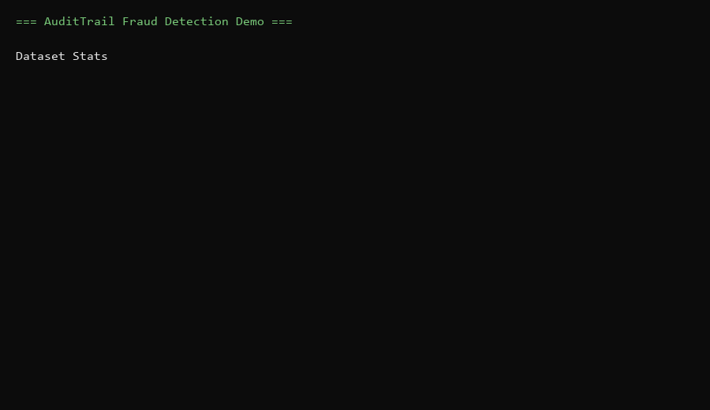

# AuditTrail SDK (Python)




Compliance-as-Code SDK for EU AI Act readiness. This MVP traces training and inference, computes fairness metrics, and exports audit-ready reports.

**Why AuditTrail**
- 2 decorators to make models audit‑proof
- Tamper‑evident logs with hash‑chain integrity
- Async batching for high‑throughput logging

**Design Partners**
We’re looking for 2–3 teams building high‑risk AI systems in the EU.  
If you want early access + roadmap influence, open a GitHub issue in this repo with a short intro.

## Installation

Editable install from the repo:

```bash
pip install -e .
```

Dependencies:
- `numpy` (core)
- `scikit-learn` (demo)
- `pytest` (tests)

## Quick Start

```python
import audittrail
from audittrail import RiskLevel, trace_training, trace_inference
from audittrail.exporters.json_exporter import export_compliance_report

audittrail.init(project="demo", risk_level=RiskLevel.HIGH, output_dir="./audit_logs")

@trace_training(dataset_version="v1", fairness_metrics=["demographic_parity"])
def train_model(X, y, sensitive_attr):
    # train and return model + fairness inputs
    return {"model": model, "y_true": y, "y_pred": y_pred, "sensitive_attr": sensitive_attr}

@trace_inference(require_human_review_threshold=0.85)
def run_inference(X):
    return model.predict_proba(X)

train_model(X_train, y_train, sensitive_attr)
run_inference(X_test[:10])
report_path = export_compliance_report()
print(report_path)
```

Expected JSON structure (high level):
```json
{
  "project": "demo",
  "generated_at": "2026-03-14T12:00:00+00:00",
  "risk_level": "HIGH",
  "traces": [
    {
      "trace_id": "...",
      "events": [ { "event_type": "training_start" }, { "event_type": "training_end" } ],
      "compliance_checks": { "demographic_parity": { "value": 0.03, "violates": false } }
    }
  ],
  "summary": { "total_traces": 1, "total_events": 2, "violations_found": 0 }
}
```

## API Reference

### `audittrail.init(project: str, risk_level: RiskLevel, output_dir: str = "./audit_logs")`
Initializes global SDK state and log output location.

### `audittrail.flush()`
Flushes any pending async log events (recommended for short‑lived scripts).

### `@trace_training(dataset_version: str, fairness_metrics: list = None)`
Decorates a training function and logs training lifecycle events.
- `dataset_version` is required.
- `fairness_metrics` is optional (currently supports `["demographic_parity"]`).

### `@trace_inference(require_human_review_threshold: float = None)`
Decorates an inference function and logs inference lifecycle events.
- `require_human_review_threshold` is optional (0–1).

### `export_compliance_report(trace_ids: list = None, output_path: str = None)`
Aggregates logs into an audit-ready JSON report.

### `verify_chain(log_path: str) -> bool`
Verifies tamper-evident hash chain integrity.

## Compliance Features

- Designed for EU AI Act high-risk systems.
- Current fairness metric support: demographic parity.
- Automatically logs:
  - Git commit (if available)
  - Hyperparameters (if model exposes `.get_params()`)
  - Human review flags for high-confidence inferences

## Running Tests

```bash
cd sdk-python
pytest
```

## Running Demo

```bash
cd demo
python fraud_detection_demo.py
```

Expected output includes:
- Dataset stats
- Training completion with trace ID
- Demographic parity result
- Human review count
- Compliance report path
- Audit chain integrity status

## Benchmark

```bash
cd demo
python benchmark.py
```

Optional plot generation:
```bash
pip install matplotlib
```

Pitch-ready chart:
```bash
python generate_pitch_chart.py
```

## Demo Dashboard (Streamlit)

```bash
pip install streamlit pandas
cd demo
streamlit run dashboard.py
```

## FastAPI Demo

```bash
pip install fastapi uvicorn
cd demo
uvicorn server:app --reload
```

## PDF Exporter (Demo)

```bash
pip install reportlab
cd demo
python pdf_exporter.py ./demo_output/<your_report>.json
```
## Async vs Sync logging

By default, logging is async via a background worker thread.
For serverless or short‑lived processes, you can force sync writes:

```bash
set AUDITTRAIL_MODE=sync
```

Tuning (optional):
- `AUDITTRAIL_BATCH_SIZE` (default 100)
- `AUDITTRAIL_FLUSH_INTERVAL` seconds (default 0.5)

## Build Windows EXE

From the repo root:

```powershell
.\build_exe.ps1
```

This creates two executables in `C:\Users\thyme\Downloads\SaaS\audittrail\dist`:
- `audittrail-demo.exe` — runs the demo end-to-end
- `audittrail-cli.exe` — exports reports and verifies audit logs

Example CLI usage:
```powershell
.\audittrail-cli.exe --project fraud-detection-demo --risk-level HIGH export-report --output-dir .\demo_output
.\audittrail-cli.exe --project fraud-detection-demo --risk-level HIGH verify-chain --output-dir .\demo_output
```
